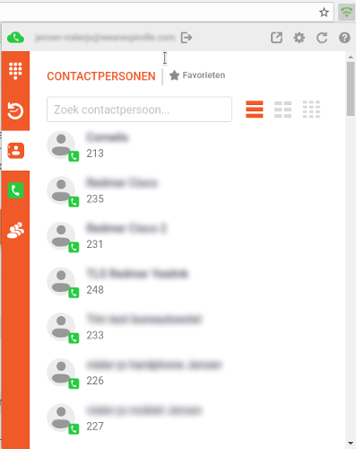
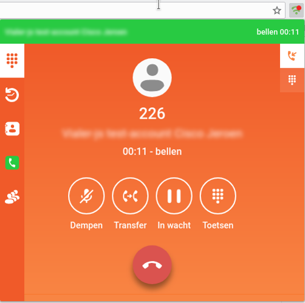

# Vialer-js
Vialer-js is an open-source softphone and communication tool in development.
It is written using an environment-agnostic JavaScript coding style,
which allows it to run as a browser WebExtension, a webpage widget, an Electron
desktop app or a headless Node.js application. It's goal is to offer a user-
and privacy-friendly unified communication experience to end-users.
It relies on WebRTC, but most of the design is already suitable to use it as
a base for other developers to incorporate their own (open) protocol
specifications with.

Currently, there is an implementation of a free SIP softphone(`CallSIP`) and an
optional proprietary calling API(`CallConnectAB`) for the [VoIPGRID platform](https://voipgrid.nl/).
The `CallSIP` implementation has all features you would expect from a softphone
like on-hold, blind & attended transfer, dealing with multiple calls and
click-to-dial in browser tabs. Its simple reactive data-orientated design makes
it easy to implement new features for multiple platforms at a very fast pace.







# Quickstart
## Requirements
* Node.js 10.0.0 or higher
* Npm 6 or higher
* Electron executable for the desktop version (optional)


## Setup
Checkout the project and install its dependencies from npm:
```bash
git clone git@github.com:VoIPGRID/vialer-js.git
cd vialer-js
npm i
# Setup the default settings file:
cp ./.vialer-jsrc.example ~/.vialer-jsrc
# Build a Chrome extension:
gulp build
```

Go to `chrome://extensions` in your Chrome/Chromium browser and point to the
`build/vialer/chrome` directory. You now have a Vialer-js softphone running
as a Chrome WebExtension! Checkout {@tutorial install} to
learn more about different builds.
